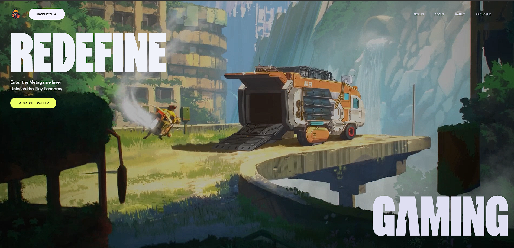

<div align="center">



<br/>
<br/>

# ZENTRAE

### *Where interaction becomes an experience.*

<p>
  
  
  
  
  
</p>

<p>
  
  
  
</p>

**[🚀 Live Demo](https://zentrae-interactive.vercel.app/)** &nbsp;&nbsp;    &nbsp;&nbsp; **[⚙️ Getting Started](#-getting-started)**

</div>

---

## ✨ Experience Preview

> Smooth transitions. Cinematic motion. Interactive storytelling.

<div align="center">


</div>

---

## ✦ What is Zentrae?

**Zentrae** is a cinematic, interaction-heavy frontend experience built entirely without any animation library shortcuts. Every motion — from the hero clip-path reveal to the scroll-triggered section entrances to the 3D bento card tilts — is hand-crafted using GSAP and vanilla JavaScript cursor tracking.

> No Framer Motion. No pre-built animation kits. Just GSAP ScrollTrigger, clip-path CSS, mouse position math, and a lot of attention to detail.

---

## ✨ Animation Breakdown

### 🎭 SVG Screen Loader — Aceternity UI
Before the site loads, a custom SVG animation plays as the entry sequence — built with Aceternity UI's loader component. Sets the cinematic tone before a single section is visible.

### 🎬 Hero — Clip-Path Reveal
The hero section uses a CSS `clip-path` micro-animation to reveal content in a way that feels editorial and cinematic — a technique rarely seen in typical portfolio sites. Paired with **4 rotating video backgrounds** that transition on interaction.

### 📜 Scroll Animations — GSAP ScrollTrigger + Timeline
Every section entrance is driven by a GSAP **Timeline** pinned to a **ScrollTrigger**. Text, images, and video elements animate in with precise timing — not on a timer, but exactly as the user scrolls.

### 🃏 3D Bento Cards — Mouse Tracking Tilt
The feature bento cards respond to your cursor in 3D space. Built with pure JavaScript — tracking `clientX` and `clientY` mouse position and converting them into `rotateX` / `rotateY` CSS transforms for a real depth illusion. No library, no shortcuts.

### 🎨 Dynamic Button Colors — Tailwind CSS
Bento card buttons dynamically shift color using Tailwind CSS utility classes injected at runtime — giving each card its own visual identity while staying within the design system.

### 🔊 Floating Navbar — Audio Toggle
The navbar floats above all content and features **animated audio bars** — a visual equalizer that pulses when background audio is playing and freezes when paused. Toggle the audio on/off for a fully immersive or silent experience.

### 🎥 Video Backgrounds
9 videos across hero and feature sections (`.mp4`, preloaded) deliver a film-like quality to section transitions and feature showcases.

---

## 📸 Sections

| Section | Description |
|---|---|
| **Loader** | SVG animated entry screen — Aceternity UI |
| **Hero** | Clip-path reveal · 4 rotating video BGs · animated title |
| **About** | GSAP scroll entrance · editorial layout |
| **Features** | 5 video cards · 3D tilt hover · dynamic button colors |
| **Story** | GSAP timeline storytelling section |
| **Contact** | Dual image layout with animated CTA |
| **Footer** | Clean close with branding |

---

## 🏗️ Project Structure

```
Zentrae-interactive/
├── src/
│   ├── components/
│   │   ├── Hero.jsx          # Clip-path reveal + rotating video backgrounds
│   │   ├── Navbar.jsx        # Floating navbar + animated audio toggle bars
│   │   ├── Loader.jsx        # Aceternity UI SVG entry animation
│   │   ├── AnimatedTitle.jsx # Reusable GSAP-powered title component
│   │   ├── Features.jsx      # Bento grid + 3D tilt + dynamic button colors
│   │   ├── About.jsx         # Scroll-triggered section entrance
│   │   ├── Story.jsx         # GSAP timeline narrative section
│   │   ├── Contact.jsx       # Dual-image animated contact section
│   │   ├── Button.jsx        # Reusable animated button component
│   │   └── Footer.jsx        # Site footer
│   │
│   ├── utils/
│   │   └── utils.js          # Mouse tracking · tilt math · shared helpers
│   │
│   ├── App.jsx               # Root component + section composition
│   ├── main.jsx              # Entry point
│   └── index.css             # Global styles + custom font declarations
│
├── public/
│   ├── videos/               # hero-1 to 4 · feature-1 to 5 (.mp4)
│   ├── img/                  # WebP optimized images (swordman · stones · gallery)
│   ├── audio/
│   │   └── loop.mp3          # Background audio for navbar toggle
│   └── fonts/                # Custom typefaces (Zentry · Robert · CircularWeb · General)
│
├── vite.config.js
└── index.html
```

---

## 🛠️ Tech Stack

| Category | Technology |
|---|---|
| **Framework** | React 19 |
| **Styling** | Tailwind CSS v4 |
| **Animations** | GSAP — ScrollTrigger + Timeline |
| **UI Components** | Aceternity UI (SVG Loader) |
| **3D Effects** | Vanilla JS mouse tracking (clientX / clientY) |
| **Micro Animations** | CSS clip-path |
| **Media** | WebP images + MP4 video backgrounds |
| **Typography** | Zentry · Robert · CircularWeb · General (custom fonts) |
| **Build Tool** | Vite 5 |
| **Deployment** | Vercel |

---

## 🚀 Getting Started

### Prerequisites
- Node.js 18+

### Run Locally

```bash
# 1. Clone the repository
git clone https://github.com/YOURCODERAYAN/Zentrae-interactive.git
cd Zentrae-interactive

# 2. Install dependencies
npm install

# 3. Start the dev server
npm run dev
```

Open `http://localhost:5173` and turn your volume up. 🔊

---

## 🎯 Key Technical Highlights

```
Clip-path animation    →  CSS-only hero reveal — no JS needed, maximum impact
GSAP ScrollTrigger     →  Frame-perfect scroll-driven animations per section
Mouse tilt effect      →  clientX/Y → rotateX/Y math — pure JS, zero dependencies
Audio visualizer       →  CSS bar animation synced to play/pause state
Video backgrounds      →  9 preloaded MP4s for cinematic section transitions
Custom fonts           →  5 typefaces loaded as WOFF2 for sharp, branded typography
WebP assets            →  All images in WebP format for fast load without quality loss
```

---

## 🗺️ Roadmap

- [x] SVG entry loader
- [x] Clip-path hero reveal
- [x] GSAP ScrollTrigger section animations
- [x] 3D bento card mouse tilt
- [x] Floating navbar with audio toggle
- [x] Video background hero + features
- [x] Vercel deployment

---

## 🤝 Contributing

```bash
git checkout -b feature/your-feature-name
git add .
git commit -m "feat: describe your change"
git push origin feature/your-feature-name
# Then open a Pull Request
```

---

## 📄 License

MIT — free to use, fork, and build on.

---

<div align="center">

Designed & built by **Ayan**

[](https://your-vercel-link.vercel.app)

*If this inspired you, a ⭐ means a lot.*

</div>
